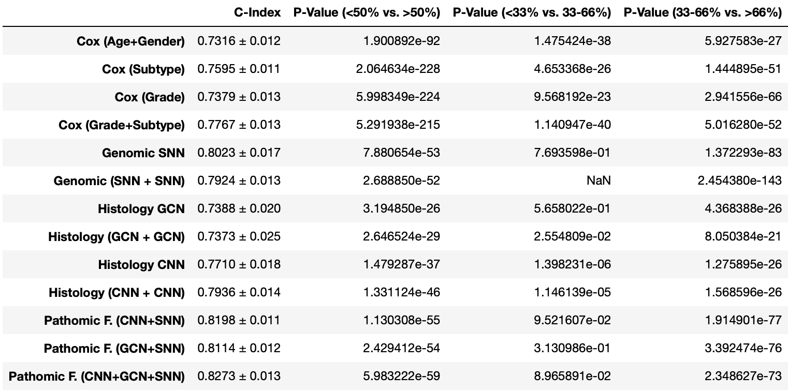

**********************************************
## **19 Pathomic Fusion: an interpretable attention-based framework that integrates genomics and imaging to predict cancer outcomes (SX263)**
**********************************************

## Summary
This `README.md` is accompanied by `reproducibility.md`.

This repository serves for the submission of the MPhil project 19: Pathomic Fusion.

In this repository, we provide the code, reproduced results, and evaluation plots to complement our analysis and discussion in the report. The executive summary and project report are located in the `report` folder of this repository, or you can download it from [Google Drive](https://drive.google.com/drive/folders/1eSqSElu6f_T8s5uEzHU6ZgzrhJ3l-HDA?usp=sharing).

To improve the efficiency and accuracy of cancer prediction, there is a pressing demand to develop a new model that extracts and combines information/features across different modalities in an integrative manner. This project aims to summarise, reproduce and improve the work in the paper published in 2020, "Pathomic Fusion: An Integrated Framework for Fusing Histopathology and Genomic Features for Cancer Diagnosis and Prognosis”, in which the novel fusion approach combines histopathology images, cell graph and genomic features for survival outcome prediction and grade classification of glioma and clear cell renal cell carcinoma. The multimodal interpretability can identify new integrative biomarkers with diagnostic, prognostic, and therapeutic relevance.

In addition to reproducing all the results from the original paper, including visualizations and local and global explanations, we develop and implement new architectures such as CellViT segmentation and multilinear/quadrilinear fusion with CONCH.

## Main Results
- **Survival analysis of GBMLGG**: the c-index values and p-values from our re-trained model by using the same data splits as the original paper.


- **Multilinear fusion with CONCH on GBMLGG**: the c-index values and p-values from our fusion strategy by using our own data splits. All models are trained from scratch.


All results are available in our report.

## Structure
- **src**: It contains the main code for this project. The code has been rewritten to adapt the latest computational environment to train and test the models. A bunch of new code has been added for further improvements.
    - **main code**: `main.py` for GBMLGG; `main_KIRC.py` for CCRCC; `main_conch` for using CONCH features; `main_multilinear_fusion.py` for new quadrilinear fusion of CNN+GCN+SNN+CONCH. Each main script comes with its corresponding train and test functions in `train_test.py`, `train_test_KIRC.py`, `train_test_conch.py` and `train_test_multilinear_fusion.py`. `networks.py` for the network architectures used in GBMLGG and CCRCC; `networks_improved.py` optimises the way of implement vgg19; `networks_conch.py` modifies the PathNet by using CONCH image encoder; `networks_IG.py` for IG visulisation with `fusion_IG.py` that solves the dimensionality issue; `functions.py` contains basic functions for data preparation and evaluation; `dataloader` loads multimodal data from data splits; `fusion.py` defines the fusion functions for multimodal networks; `options.py` contains all the options for the argparser; `test_CNN.py` and `test_15_fold.py` are used for CNN testing specifically because the original code mistakenly extract image features twice during testing.
    - **make_splits**: `make_splits.py` for extraction and alignment of multimodal data from GBMLGG; `makes_splits_conch.py` for data splits by extracting CONCH features; `make_splits_multilinear_fusion.py` for data splits that store CNN, CONCH, cell graph and genomic modalities; `make_splits_CNN.py` for data splits used to test CNN; `make_splits_whole_data.py` does not assign train and test groups, making all patients in the same group for IG global explanation.
    - **Grad-CAM**: `Grad-CAM_self_written_without_classifier.py` for vgg19 and `Grad-CAM_self_written_resnet50.py` for resnet50 are the main self-written code used for Grad-CAM visualisation, and the target layer is located at the last layer of the feature encoder without passing through the classifier. `Grad-CAM_self_written.py` attempts to produce Grad-CAM heatmap by passing through the classifier. `Grad-CAM_with_packages.py` directly applies the algorithms from [pytorch-grad-cam](https://github.com/jacobgil/pytorch-grad-cam), and its source code can be found in the `src/pytorch_grad_cam` folder. Output plots can be found in the `Grad_CAM_output_with_packages`, `Grad_CAM_output_with_packages_vgg19`, `Grad_CAM_self_written_code_resnet50` and `Grad_CAM_self_written_code_vgg19` folders.
    - **IG**: `IG_histomolecular.py` for IG SNN global explanation of molecular subtypes (IDHwt, IDHmut, ODG); `IG_whole_data.py` for IG SNN global explanation of all patients without dividing them into molecular subtypes; `IG_localisation.py` for IG SNN local explanation of individual patient; `IG_bilinear.py` for IG CNN+SNN global explanation of molecular subtypes; `IG_trilinear.py` for IG CNN+GCN+SNN global explanation of molecular subtypes; `IG_graph_centroid.py` and `IG_graph_final.py` for IG GCN local explanation of individual patient, without and with H&E data, respectively. Output plots can be found in the `visualisation_plots` folder.
    - **KAN**: `main_KAN.py` for training the model with KAN architecture; we only modify the genomic unimodal network with KANs in `networks_KAN.py`, and train and test functions have been updated in `train_test_KAN.py`.
    - **1_fold**: It contains scripts for 1-fold cross-validation, saving significant time during early development.

- **checkpoints**: It contains the training and testing results for each model at every epoch (15-fold), including metrics such as the c-index and prediction accuracy. The trained model `.pt` files can be downloaded from `checkpoints` folder on [Google Drive](https://drive.google.com/drive/folders/16dPY5ekOK3Zu67Cctm4yY868XlCCqegn?usp=sharing).
    - **TCGA_GBMLGG**: `surv_15_paper` contains the results by using the original data splits from the paper for survival analysis; `surv_15_rnaseq` contains the results by using our own data splits for survival analysis; `surv_15_conch` contains the results by using our own data splits with CONCH features for survival analysis; `surv_15_KAN` contains results for the genomic SNN model, where MLPs have been replaced with KANs; `grad_15_paper` contains the results by using the original data splits from the paper for grade classification; `grad_15_conch` contains the results of image features by using our own data splits with CONCH features for grade classification. Evaluation plots about patitent stratification and hazard distribution can be found in the corresponding folders.
    - **TCGA_KIRC**: `surv_15_paper` contains the results by using the original data splits from the paper for survival analysis, and evaluation plots about patitent stratification and hazard distribution can be found in this repository. Grade classification has not been done on KIRC.
    - **conch**: The pretrained CONCH model `pytorch_model.bin` can be downloaded from [Google Drive](https://drive.google.com/drive/folders/16dPY5ekOK3Zu67Cctm4yY868XlCCqegn?usp=sharing), and it should be put in the `checkpoints/conch` when you want to extract CONCH image embeddings.

- **data**: It contains the data splits for GBMLGG and KIRC, and the original images and cell graph files can be downloaded from `data` folder on [Google Drive](https://drive.google.com/drive/folders/16dPY5ekOK3Zu67Cctm4yY868XlCCqegn?usp=sharing).

- **cell_graph_reconstruction**: It contains the CPC model, MaskCNN and layer functions to extract cell features (CPC) and construct cell graphs for GCNs. The pretained cpc model can be downloaded from [Google Drive](https://drive.google.com/drive/folders/16dPY5ekOK3Zu67Cctm4yY868XlCCqegn?usp=sharing). `cpc_file_verification.ipynb` and `cpc_file_verification_KIRC.ipynb` are used to check if the cell graph .pt files have correct edge indices and the appropriate number of nodes.

- **core**: It contains evaluation functions for tasks such as computing the c-index and making Kaplan-Meier curves.

- **evaluations**: It contains notebooks that utilize functions from the `core` folder to conduct analysis with our results from the `checkpoints` folder. These notebooks can be run smoothly with `checkpoints` to obtain results in our report.

- **CellViT**: It contains the code and configurations for CellViT vision transformers, which can replace the conditional GAN for nuclei segmentation from the original paper. Most scripts are sourced from their original repository [CellViT](https://github.com/TIO-IKIM/CellViT), we have modified the code of the cell decection type to include neoplastic, inflammatory, epithelial, etc. We also add new preprossing configurations in `preprocessing_example.yaml` and `preprocessing_example_glioma.yaml`. The pretrained CellViT model `CellViT-SAM-H-x40.pth` can be downloaded from [Google Drive](https://drive.google.com/drive/folders/16dPY5ekOK3Zu67Cctm4yY868XlCCqegn?usp=sharing), and please place it in the `CellViT/models/pretrained` folder when using. `environment_CellViT.yml` has been included to ensure reproducibility.

- **CellViT_output**: It contains the cell detectiona and classification output from CellViT, notebook that draw contours around neoplastic cells for visualisation purposes, and segmentation images used in our report. It is possible to import results `.geojson files` into viewing software such as [QuPath](https://qupath.github.io/). The trained `cells.pt` file and our `.svs` examples can be downloaded from [Google Drive](https://drive.google.com/drive/folders/16dPY5ekOK3Zu67Cctm4yY868XlCCqegn?usp=sharing).

- **report**: It contains our executive summary and project report.

- **docs**: It contains the files from auto-documentation by using `doxygen` and `Doxyfile`.


## Data and Pretrained Models
All the datasets and pretrained models can be downloaded from [Google Drive](https://drive.google.com/drive/folders/16dPY5ekOK3Zu67Cctm4yY868XlCCqegn?usp=sharing).

You can also run `get_data.py` to automatically download all the shared folders from Google Drive, but you might need to set up `pydrive` and credentials before hand.

Note that the original datasets (.pt files) are outdated, we have updated those files by running
```bash
$ python updates.py
```
```bash
$ python updates_KIRC.py
```

## Usage
Note that the `reproducibility.md` file contains detailed commands for training and testing each model.

For the train and test, the first step is making appropriate data splits, for example,
```bash
$ python src/make_splits/make_splits.py --ignore_missing_moltype 1 --ignore_missing_histype 0 --use_vgg_features 1 --roi_dir all_st_patches_512 --exp_name surv_15_rnaseq --use_rnaseq 1 --gpu_ids 0
```

Then you can run the main script by specifying the task and hyperparameter, for example,
```bash
$ python src/main.py --exp_name surv_15_paper --task surv --mode pathgraphomic --model_name pathgraphomic_fusion --niter 10 --niter_decay 20 --lr 0.0001 --beta1 0.5 --fusion_type pofusion_A --mmhid 64 --use_bilinear 1 --use_vgg_features 1 --gpu_ids 0 --omic_gate 0 --grph_scale 2 --use_rnaseq 1 --input_size_omic 320
```

An example code for training and testing with multilinear fusion:
```bash
$ python src/main_multilinear_fusion.py --exp_name surv_15_rnaseq --task surv --mode multilinear --model_name multilinear_fusion --niter 10 --niter_decay 20 --lr 0.0001 --beta1 0.5 --fusion_type multilinearfusion --mmhid 64 --use_bilinear 1 --use_vgg_features 1 --use_conch_features 1 --gpu_ids 0 --omic_gate 0 --grph_scale 2 --use_rnaseq 1 --input_size_omic 320
```

An example code for Grad-CAM is,
```bash
$ python src/Grad-CAM/Grad-CAM_self_written_resnet50.py
```
```bash
$ python src/Grad-CAM/Grad-CAM_with_packages.py --output_dir Grad_CAM_output_with_packages_vgg19
```

An example code for IG is,
```bash
$ python src/IG/IG_localisation.py --exp_name surv_15_paper --task surv --mode omic --model_name omic --niter 0 --niter_decay 30 --batch_size 64 --reg_type all --init_type max --lr 0.002 --weight_decay 5e-4 --gpu_ids 0 --use_rnaseq 1 --input_size_omic 320 --verbose 1
```

An example code for KAN is,
```bash
$ python src/KAN/main_KAN.py --exp_name surv_15_KAN_25_june --task surv --mode omic --model_name omic --niter 0 --niter_decay 1 --batch_size 30 --reg_type all --init_type max --lr 0.002 --weight_decay 5e-4 --gpu_ids 0 --use_rnaseq 1 --input_size_omic 320 --verbose 1
```

## Reproducibility
- The list of environment's dependencies and their respective versions can be found in `environment.yml`, which can be used to build the same conda environment we use.
```bash
$ conda env create -f environment.yml
```
After that, you need to manually install PyTorch with CUDA support based on your CUDA version, [PyTorch starts locally](https://pytorch.org/get-started/locally/).
Packages such as torch-scatter and CONCH need to be installed manually using,
```bash
$ pip install git+https://github.com/Mahmoodlab/CONCH.git
$ pip install torch-scatter
```

- There is a dockerfile, and it can be used to create small virtual OS which are identical on any machine. This makes applications much more stable and portable. However, it is difficult to train models on Docker due to the limited GPU support.
Please ensure the Docker Desktop is already installed, and follow these steps:
```bash
$ docker build -t (name_of_image) .
$ docker image ls
$ docker run -d -t --name= (name_of_container) (name_of_image)
$ docker exec -ti (name_of_container) bash
```
After running the above steps in the terminal, the conda environment `pathomic_fusion_hpc` should be automatically activated.

## Potential Issue
We do not recommend to use Docker container to train and test models due to (1) the limited GPU support and (2) some datasets and pretrained models are very large, making it time-consuming to download and mount them into the container. You may need to adjust the container's storage limit settings. However, it is straightforward to conduct evaluations on Docker container.

We create new data splits for visualisation and local and global explanation, so the output plots may slightly differ from those in the paper.

## Auto-documentation
The auto-documentation can be done via `doxygen`, and you can also modifty the `Doxyfile` in `docs`. The auto-documentation can be run by:
```bash
$ cd docs
$ doxygen
```

## Machine
We have worked on local machine, but switched to hpc since the Mac GPU does not support GCNs and fusion operations. We use the third-party hpc service rather than CSD3.
- **local machine**:
    - laptop model: Apple MacBook Pro 2023, M3 Pro chip
    - Memory: 18GB
    - Operating System: 14.1 Sonoma
- **hpc1**:
    - CPU: 16 vCPU AMD EPYC 9654 96-Core Processor
    - Memory: 60GB
    - GPU: RTX 4090 (24GB)
    - Operating System: ubuntu22.04
    - CUDA 12.1
- **hpc2**:
    - CPU: 20 vCPU Intel(R) Xeon(R) Platinum 8457C
    - Memory: 100GB
    - GPU: L20 (48GB)
    - Operating System: ubuntu22.04
    - CUDA 12.1

## Acknowledgement
The autocompletion feature of GitHub Copilot was passively used throughout the code development process. It is pervasive to all the code without the use of any specific prompts.

The writing of this report was completed manually without the use of any auto-generation tools.

## License
This project is licensed under the MIT license.

## Author
Shizhe Xu, sx263@cam.ac.uk

## Date
29 June 2024
